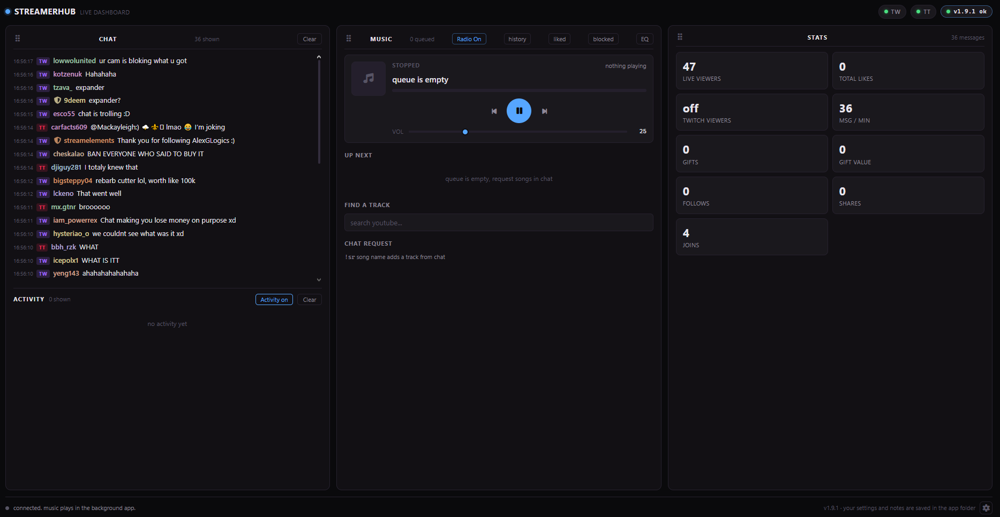
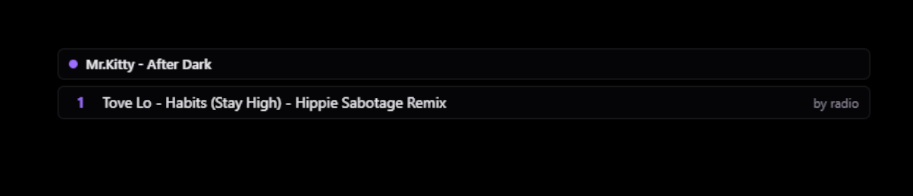

<p align="center">
  <h1 align="center">StreamerHub</h1>
  <p align="center">Both chats, live numbers, and viewer song requests in one tab.</p>
</p>

<p align="center">
  
  
  
</p>

---

Everything your stream needs in one browser tab: chat from **Twitch** and **TikTok** side by side, live numbers, and a music box your viewers load songs into. It runs on your PC and quietly lives in the system tray.

> **Local first** — internet is only needed for the chat feeds, YouTube search, and audio. Everything else stays on your PC.

<p align="center">
  
</p>

---

## Features

### Chat

| Feature | Description |
|---|---|
| **Both chats, one column** | Twitch and TikTok newest-on-top, with platform badges and a shield for mods |
| **Quiet bot** | Only song requests appear in the feed. Nothing is ever written to your Twitch or TikTok chat |
| **Clear chat** | Hold the button (it fills as you hold) to wipe the on-screen feed |

### Live stats

Viewers, likes, gifts (with diamond value), follows, shares, joins. They update as they happen.

### Music

| Feature | Description |
|---|---|
| **Viewer requests** | Viewers type `!sr song name` in chat, the song lands in the queue and plays |
| **Background player** | Music runs in mpv, its own app with its own sound — capture it in OBS as a normal channel |
| **Keeps playing** | Close the tab or the browser and it keeps going; reopen and it shows exactly where it is |
| **Full transport** | Play, pause, previous, skip, volume, scrub bar (drag or arrow keys nudge 5s) |
| **EQ & loudness** | Slim 10-band equalizer (plus Flat / Bass+ / Vocal / Club presets) and a loudness switch, both saved |
| **Library lists** | History, liked, and blocked songs live under the player |
| **Radio fallback** | When the queue runs out, one similar song plays, picked and preloaded before the current ends. Turn "radio off" to stop instead |

### Layout

Drag the chat, stats, and music panels by their title bars into any order. It remembers for next time.

---

## Requirements

- Windows 10 / 11
- Internet (chat feeds, YouTube search, and audio run online; everything else stays local)
- OBS (optional, for capturing the music channel and showing the queue overlay)

---

## Get StreamerHub

### Download the release (recommended)

1. Grab the newest zip from the [releases page](https://github.com/Vider7/StreamerHub/releases) and unzip it anywhere.
2. Run **`StreamerHub.exe`**. The dashboard opens in your browser; the app sits in the system tray.
3. A first-time setup walks you through pointing it at your accounts: your Twitch channel and TikTok username (no `@`). The lights in the top bar show when they connect.

### Build it yourself

Needs the .NET SDK and Node.js. Clone the repo and run **`build.bat`** — output is `dist\StreamerHub.exe`. (Developers: `install.bat` installs it to `%LOCALAPPDATA%\StreamerHub` with a Start Menu shortcut instead.)

---

## Updates

The app checks for updates on its own and shows a chip in the top bar when one is ready:

| Action | How |
|---|---|
| Check now | Click the version chip → check |
| Install | Click the **update** button — it downloads, verifies, swaps itself in, and restarts. Music resumes where it was |
| After updating | The dashboard tab reloads itself into the new version |

Your settings and lists survive every update. If anything ever goes truly sideways, redownload the zip and drop your old `Config.json` next to the new exe so you keep your channel names.

---

## Usage

### Music panel

| Action | How |
|---|---|
| Add a song | Search box, type a name, Enter — **play** starts it now, **+ queue** lines it up |
| Reorder the line | Drag queue rows up or down |
| Jump around a song | Drag the thin bar under the title, or arrow keys nudge 5 seconds |
| Controls | Play/pause, previous, skip, volume slider |
| EQ & loudness | Under the player, saved automatically |

### Chat panel

Viewers request songs with `!sr` plus a song name (links are rejected, names only). Requests are skipped when longer than `MaxTrackMinutes`, when the queue is full, or when the same viewer asks again too fast.

### Dashboard

| Action | How |
|---|---|
| Rearrange | Drag panels by their title bars (chat / stats / music) |
| Resize activity | Drag the divider above the activity feed up or down |
| Change theme | Gear icon → themes (amber, rose, mint, violet, blue, rgb) |
| Open it again | Double-click the tray icon |
| Stop it | Right-click the tray icon → **Quit** |

### Themes

Switch anytime in the gear menu. The accent follows the theme everywhere (live tile, progress bar, update chip):

<p>
  
  
  
  
  
  
</p>

### Stream overlay

Show the live queue on stream: add a browser source in OBS pointing at `http://127.0.0.1:51324/overlay.html`. Transparent background, current song plus what's queued. It follows your dashboard theme automatically.

<p align="center">
  
</p>

---

## Settings

`Config.json` lives next to the app (the setup wizard and the settings gear both write it too). Change it by hand, save, reopen the app. Done.

```
{
  "AppName": "StreamerHub",
  "Layout": "CSM",                  // panel order: C = chat, S = stats, M = music
  "Port": 51324,                    // the number used in the page address
  "AutoOpenBrowser": true,          // true = the page opens once on first run (tray icon reopens it later)
  "Twitch": {
    "Channel": "your-channel-name", // your Twitch channel name
    "ClientId": "",                 // optional: for Twitch viewer count, see below
    "ClientSecret": "",             // optional: same
    "PollViewersSeconds": 45        // how often to count Twitch viewers
  },
  "TikTok": {
    "Username": "your-tiktok-name", // your TikTok name, no @
    "CustomSigningServer": "",      // optional, for flaky TikTok connections
    "SigningServerApiKey": ""
  },
  "Music": {
    "Command": "!sr",               // the word in chat that requests a song
    "YtDlpPath": "",                // leave empty to use the yt-dlp in tools
    "YtDlpCookiesFile": "",         // optional: full path to a cookies.txt if YouTube blocks searches
    "DefaultVolume": 25,            // how loud new songs start
    "MaxTrackMinutes": 10,          // longest song a request can be
    "MaxQueueLength": 20,           // song line limit
    "MaxQueryLength": 100,          // how long a request text can be
    "RateLimitSeconds": 15,         // wait between requests per viewer
    "GlobalCooldownSeconds": 5,     // pause between requests from chat
    "AutoNextRadio": true,          // true = a similar song plays when the queue runs out
    "MpvPath": "",                  // leave empty to use the mpv in tools
    "AudioDevice": "",              // empty = your default sound output; set one for a specific device
    "Equalizer": [0,0,0,0,0,0,0,0,0,0], // 10-band EQ, each band -12 to +12
    "Loudness": false               // true = smooth out the sound for streaming
  },
  "Updater": {
    "Enabled": true,                // the built-in update checker
    "Feed": "https://raw.githubusercontent.com/Vider7/StreamerHub/main/version.json",
    "AutoCheckHours": 2.0           // how often to check, in hours
  }
}
```

### Twitch viewer count (optional, free)

Chat works with no key at all; without one the dashboard just shows "viewer count off" for that tile. Want the number? Register an app at `https://dev.twitch.tv/console/apps`, paste its **Client ID** into `Twitch.ClientId` and **Client Secret** into `Twitch.ClientSecret`, save, reopen.

### Putting the music on your stream

1. Play a song once (so the background player is running).
2. In OBS, add an **Application Audio Capture** source and pick the **mpv** entry.
3. The song now has its own fader, mute button, and routing, like any other source. Keep the dashboard volume fairly high and use the OBS fader for stream level.

No window to capture: the player has no UI. If Application Audio Capture is missing on your Windows version, fall back to **Audio Output Capture**, or set `Music.AudioDevice` to send music to its own output device.

---

## If something looks wrong

| Symptom | Fix |
|---|---|
| Not sure what's happening | Read the status text at the bottom of the page and the lights in the top bar |
| No music | Make sure `mpv.exe` is in `tools\mpv` next to the app, then play a song |
| Check says up to date right after a release | Wait a few minutes and check again — the update feed takes a moment to refresh |
| Need help from a friend | Send them `logs\app.log` from the app folder — usually everything they need |

---

## Building from Source

Source code is in `StreamerHub/` (C# server) and `web/` (React dashboard). Build with:

```
build.bat
```

Output: `dist\StreamerHub.exe`. Requires the .NET SDK and Node.js. To ship a release zip + update feed, run `package.bat` (see `scripts/README.md`).

---

## License

[MIT](LICENSE)
